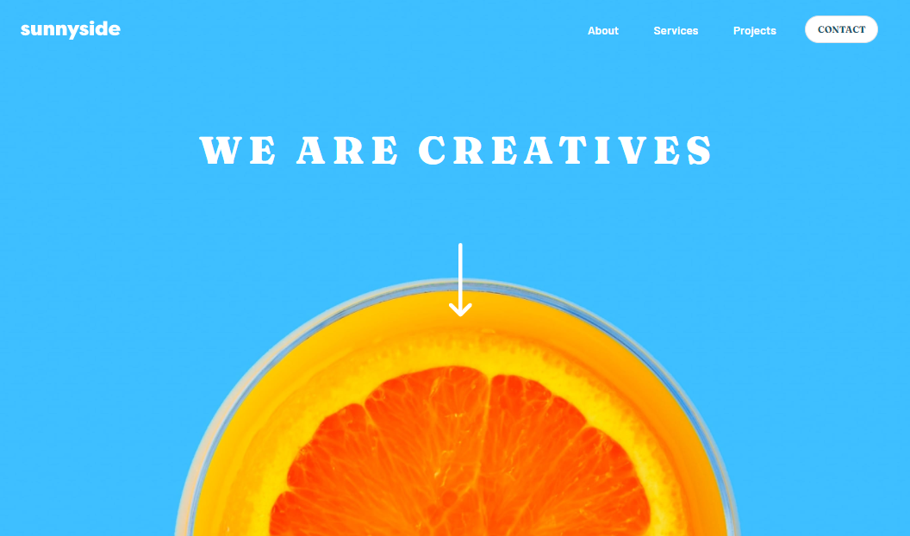

 

# Frontend Mentor - Sunnyside agency landing page solution

This is a solution to the [Sunnyside agency landing page challenge on Frontend Mentor](https://www.frontendmentor.io/challenges/sunnyside-agency-landing-page-7yVs3B6ef). Frontend Mentor challenges help you improve your coding skills by building realistic projects.

## Table of contents

- [Overview](#overview)
  - [The challenge](#the-challenge)
  - [Screenshot](#screenshot)
  - [Links](#links)
- [My process](#my-process)
  - [Built with](#built-with)
- [Author](#author)

## Overview

### The challenge

Users should be able to:

- View the optimal layout for the site depending on their device's screen size
- See hover states for all interactive elements on the page

### Screenshot

### Links

- Solution URL: [github.com/marckesin/Sunnyside-Agency-Landing-Page](https://github.com/marckesin/Sunnyside-Agency-Landing-Page)
- Live Site URL: [sunnyside-agency-landing-page.onrender.com/](https://sunnyside-agency-landing-page.onrender.com/)

## My process

### Built with

- [Render](https://render.com/) - Host static sites, APIs, containers
- [Bootstrap](https://getbootstrap.com/) - Frontend CSS library
- Semantic HTML5 markup
- CSS custom properties
- Flexbox
- Mobile-first workflow
- SASS

## Author

- Frontend Mentor - [@marckesin](https://www.frontendmentor.io/profile/marckesin)
- Linkedin - [marckesin](https://www.linkedin.com/in/marckesin)
- Codewars - [marckesin](https://www.codewars.com/users/marckesin)
